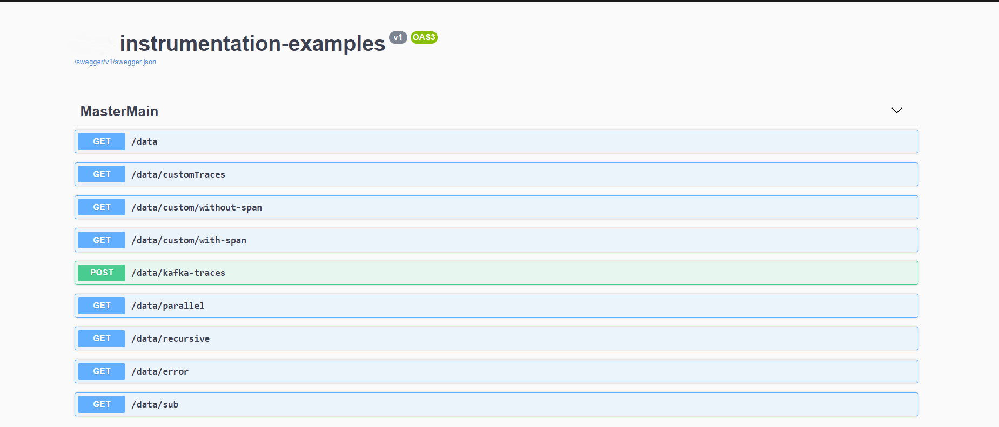
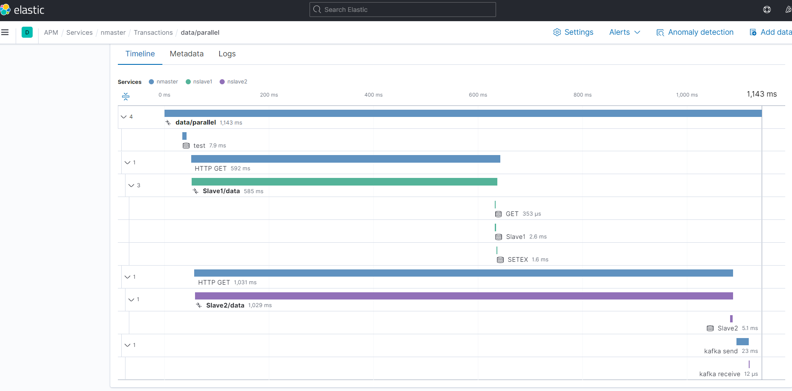
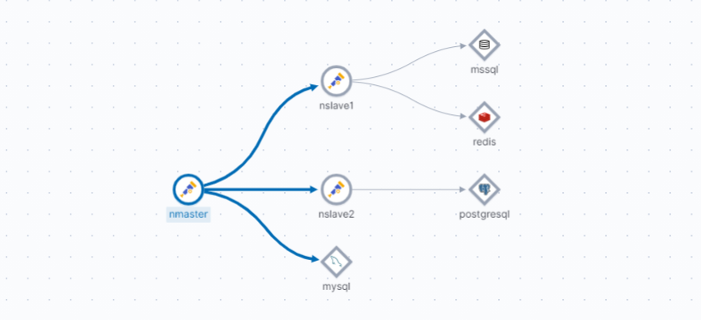

# instrumentation-examples
This project is example how you can integrate with instrumentation-sdk.

#### Demo

+ Run `docker-compose up --build`
+ Open [kibana](http://localhost:5601)
  + create ***__apm__*** index. Open `Stack Management --> Index Management`
+ Open [swagger](http://localhost/swagger/index.html)
You can execute next cases:

+ Open [kibana APM](http://localhost:5601/app/apm/services?rangeFrom=now-15m&rangeTo=now)

for ***data/parallel*** case should be rendered next chart

## Service Map

## Documentation for services

* [Master](./Src/Logging.Service.Master/README.md)
* [Slave1](./Src/Logging.Service.Slave1/README.md)
* [Slave2](./Src/Logging.Service.Slave2/README.md)
* [KafkaConsoleApp](./Src/Logging.KafkaConsoleApp/README.md)
